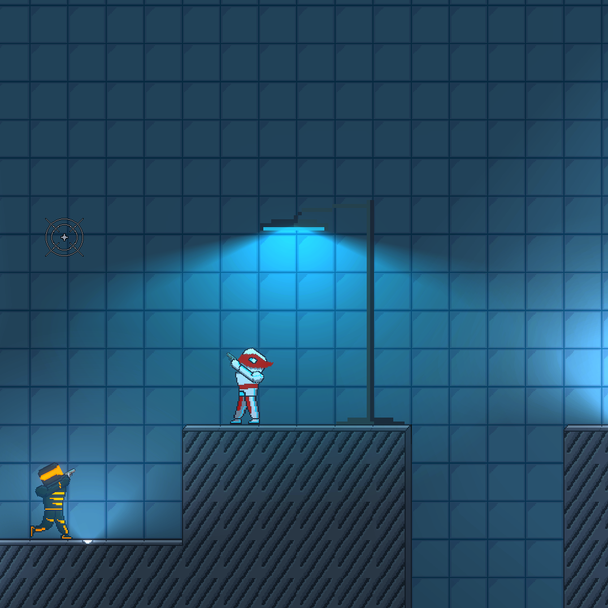

# Calibrate

A 2D pixel art side‑scroller shooter.

The player is equipped with a gun and a grapple, allowing for huge maneuverability and fast‑paced gameplay.

Made using Unity, implemented using components, scriptable objects, serialization, tile maps, etc.

